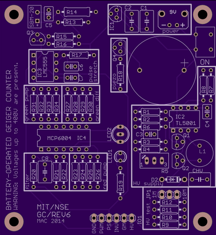

# Geiger Counter

 A Geiger counter is a practical electronic device used to measure ionizing radiation, and it is widely used in experimental physics and nuclear industries. Our goal for this project was to build a custom Geiger counter to measure the count rate of radioactive sources. After building the Geiger counter, we characterized various parameters of our device such as the dead time and tube efficiency. Using our completed device, we measured and compared the attenuation coefficients of various materials for beta and gamma radiation from Co60 and Sr90. 

  
  
  ## Table of Contents
* [Motivation](https://github.com/stimm78/Geiger_counter#motivation)
* [Theory](https://github.com/stimm78/Geiger_counter#theory)
* [Design](https://github.com/stimm78/Geiger_counter#design)
* [Device Characterization](https://github.com/stimm78/Geiger_counter#device-characterization)
* [Experiments](https://github.com/stimm78/Geiger_counter#experiments)
* [Acknowledgements](https://github.com/stimm78/Geiger_counter#acknowledgements)

## Motivation 
The radiation we are observing is ionizing radiation, carriers of enough energy to ionize many common materials. The lower bound for this energy is considered to be about 10 eV, which encompasses alpha particles (He nuclei), beta particles (electrons), and gamma rays (photons). These subatomic particles are not visible to the naked eye; to verify their existence and our physical models of their behavior, it is necessary to build specialized nuclear detector devices such as our geiger counter.

 In particular, our group was interested in testing the drop-off of the intensity of nuclear radiation with distance and with material thickness. We expect that the radiation emitted from our sources are isotropic, so the intensity is expected to drop off as $1/r^2$, where r is the distance from the source. By modeling the attenuation of radiation as being attributed to random scattering/absorption by the atoms of an attenuating material, we should also expect the intensity of ionizing radiation should drop off exponentially as $I = I_0e^{(\mu/\rho)\rho t}$.

## Theory 

A GM counter is a nuclear detector which is capable of detecting alpha particles, beta particles, and gamma radiation. To detect these ionizing particles, the geiger counter is specially designed to amplify the electrical discharge from one ionized atom and read this discharge as a voltage drop across a resistor.

The Geiger Muller counter is a metallic tube with a tungsten rod connecting the anode and cathode, filled with a gaseous mixture primarily composed of noble gas with some organic compound like ethanol mixed within it. When we connect the cylinder to the negative terminal of a high voltage source, a large voltage gap is generated between the tungsten and the metallic cylinder, creating a large electric field within the tube. When ionizing radiation enters the tube and ionizes an atom, the released electron is accelerated by the electric field, gaining sufficient kinetic energy to further ionize other atoms, whose electron offspring get accelerated by the electric field, which ionizes more atoms, etc.. This positive feedback loop of ionization is called the Townsend Avalanche, which amplifies the electrical discharge until the electrons reach the central electrode to move along the body of the circuit. Meanwhile, the positive cations leftover from ionization are pushed away from the central electrode towards the outer metallic cylinder. Our impulse of current will then run through a resistor, creating a measurable voltage drop measurable by a detector. The current will the move along back to the end of the tube, recombining with the positive charges lingering on the metallic cylinder and resetting our tube to take further measurements.

When ionizing radiation triggers the avalanche effect, the tube is temporarily unable to detect new radiation due to the time it takes for all the wonderful physics outlined above to run its course when a particle is detected. This temporary insensitivity to radiation is called the dead time of the counter. To maximize the reliability of our measurements, we should minimize the dead time. This is a key limitation to geiger counters - they are not accurate for extremely high counting rates, or equivalently when there are a high amount of nuclear particles striking the tube. Another limitation is that the Geiger counter cannot distinguish between the energies of two different nuclear particles; the current pulse generated by the tube is the same.

Some ionizing radiation will pass through the tube without ionizing any atoms, adding further uncertainty to our measurement of the radiation intensity. The ratio between the measured count rate from the geiger counter and the true one calculated from the activity level of our source is called the tube efficiency. This metric should be as high as possible to improve the reliability of our measurement.

## Design
### List of Components

### Circuit Diagram

We used a 9V battery source to power the circuit. The HV supply is achieved using a boost converter (TL5001) which steps the voltage up to 400V as required by the GM tube. When ionizing radiation is detected, the GM tube emits a current pulse which can be converted into a voltage pulse through a 5.1 kOhm resistor. The inverter is a BJT that acts as a switch to invert the voltage pulse.  Since these pulses are extremely short, the pulse stretcher (555 timer) converts the original pulse into a 1.5ms long square pulse. The blue LED will flash and the piezo speaker will click whenever a pulse is detected. The filter
smooths out voltage pulses and produces a voltage that is proportional to the count rate. The red and green current pumps convert the filtered voltage to a proportional current. The difference amplifier subtracts the filter voltage from a reference voltage, which causes the green LED to fade as the count rate increases. The RG LED serves as a visual indication of the count rate, with red corresponding to a high count rate and green corresponding to a low count rate.
### PCB

We assembled these components onto a PCB that was designed and made available by [MIT](https://ocw.mit.edu/courses/22-s902-do-it-yourself-diy-geiger-counters-january-iap-2015/pages/labs/), with modifications to the HV supply in order to achieve the desired boost voltage. It turns out that the components around the HV booster designed by MIT do not work with the TL5001 chip, and we had to modify several components around the HV supply. We changed the resistors in the diagram to the following values: R8 = 500 KOhm, R7 = 460 KOhm, R4 = 10KOhm; Potentiometer: 10KOhm; R3 = 6.4 MOhm. This gave a range of voltage values across the GM tube from 320V to 480V, which we could tune using the potentiometer. The GM tube we used is the SBM-20 GM tube, which has an operating voltage range of 375-475 Volts.

### Counting Rate

### 3D Printed Case

## Device Characterization
To verify the effectiveness of our measurements, we characterized our geiger counter by measuring its tube efficiency and dead time.
### Dead Time
In order to measure the dead time of the GM tube, we placed a source of Sr90 as close to the tube as possible (approximately 1 mm). We then connected the PCB to the oscilloscope and measured the smallest time between pulses. The dead time of the GM tube at 400V was measured to be around 500 microseconds, which is close to the stated dead time of 190 microseconds on the [SBM20 data sheet](https://www.gstube.com/data/2398/).

### Tube Efficiency
The PCB has a potentiometer to tune the voltage across the GM tube. Although the data sheet says that the tube has an operating voltage range of 350-475 volts, we wanted to determine the optimal voltage to maximize tube efficiency. To find the tube efficiency, we calculated the expected count rate of Sr90 using its labeled true activity and its solid angle relative to the tube. For Sr90, the expected count rate turned out to be approximately 20.4 counts/second.

<!-- Insert tube efficiency vs voltage graph -->

As shown in the plot, the tube efficiency did not vary too much based on the voltage. The range of efficiencies went from 0.738 to 0.770, with the “optimal” voltage near 375V.
## Experiments
### Radioactive Sources
<!-- Insert Co60 and Sr90 decay equations -->
<!-- Insert Co60 and Sr90 decay equations -->

We tested our Geiger counter using two radioactive sources: Co60 and Sr90. As shown in the equation, Co60 emits beta and gamma radiation while Sr90 emits only beta radiation.

### Experimental Method
### Results
## Acknowledgements
This project was made for Phys CS 15C lab at UCSB. Contributors are Deven Tseng, Aditya Chezhiyan, and Brian Chang. 
